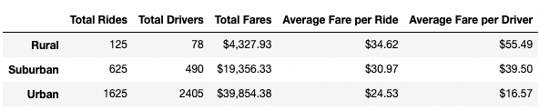
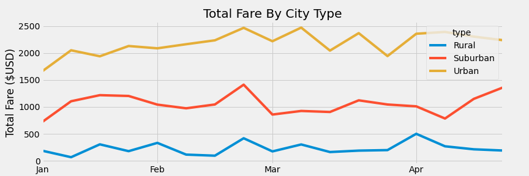

# PyBer Challenge Analysis
## Purpose:

Use Python and Pandas to create summary dataframes for ride-sharing by city types. Use matplotlib to create a line graph in order to show the total fares of each city type by weeks. This chart will help decision makers at Pyber see the data in a readable matter so they can look at the differences in different city types and help them make certain decisions.

## Results:

### Pivot Table of Pyber Average Summary
The table below is a result from merging two data sets (cities_data.csv and ride_data.csv) and then using the groupby() function for find the total rides, total drivers, total fares and then use them to find the average fare per ride and driver.\

- We can see Urban cities have more than twice the amount of total rides as suburban cities, but Urban cities have significantly more drivers than rides being requested, which then results in a lower average fare per driver. 
- Ubran cities have the lowest average fare per ride but have the largest amount of total rides, resulting in a low average fare per ride compared to suburban and rural cities. 
- Rural drivers have a significantly larger average fare, although there is much less ride requests going on in rural cities.

### Total Fare by City Type

## Summary:

- incentivise or suggest drivers in Urban cities also seek out rides in suburban and rural areas.
- Reduce the number of drivers in Urban cities
- Increase the average fare per ride in Urban cities
